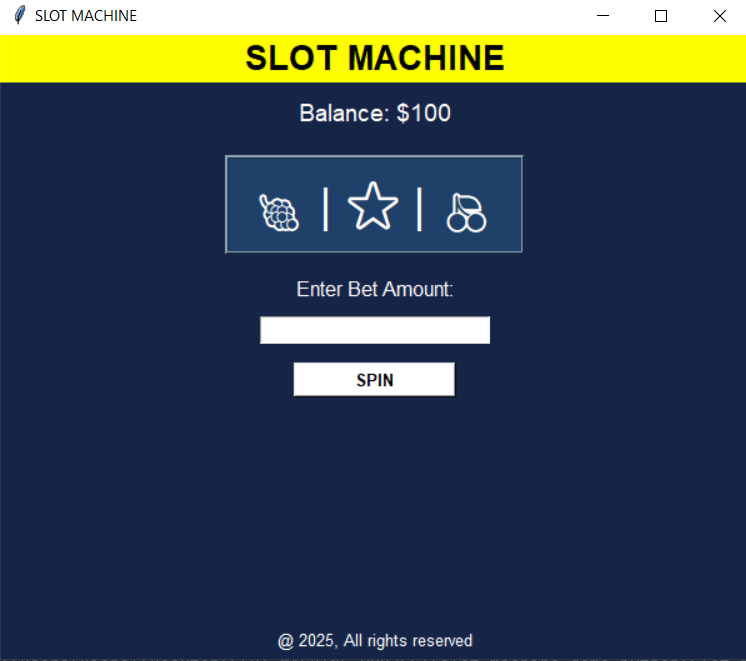

# Slot Machine Game (Python) 

A simple slot machine game built using Python and Tkinter.



## Features
- Interactive slot machine with animations
- Betting system with balance tracking
- Win/Loss conditions with color feedback
- Splash screen with a loading animation
- Keyboard shortcut to spin (Press `Enter`)

## Installation
1. Clone the repository:
   ```sh
   git clone https://github.com/your-username/slot-machine-game-python.git
   ```
2. Navigate to the project folder:
   ```sh
   cd slot-machine-game-python
   ```
3. Install dependencies (if needed):
   ```sh
   pip install tk
   ```

## Usage
Run the script:
```sh
python slot_machine.py
```

## How to Play
1. Enter your bet amount in the input box.
2. Press the `SPIN` button or hit `Enter`.
3. If all symbols match, you win!
4. Your balance updates after each spin.

## License


This project is licensed under the MIT License.

##  Youtube
<h4>If you like, do follow me on Youtube</h4>
<a href="https://www.youtube.com/@Code-With-Vishal">Connect with me on Youtube</a>

##  Instagram
<h4>If you like, do follow me on Instagram</h4>
<a href="https://www.instagram.com/vishaal_87">Connect with me on Instagram</a>
